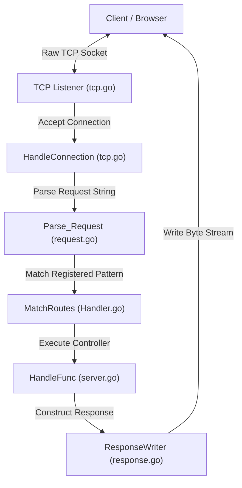

An HTTP server library built from scratch in Go on top of raw TCP, no `net/http` under the hood. This system parses raw byte streams from TCP sockets, matches routes with dynamic path parameters, and formats and writes HTTP-compliant responses back to the client.

## Table of Contents
- [Architecture](#architecture)
- [Key Features](#key-features)
- [Key Code Components](#key-code-components)
- [How It Works](#how-it-works)
  - [TCP Connection Loop](#tcp-connection-loop)
  - [HTTP Parsing](#http-parsing)
  - [Route Matching](#route-matching)
  - [Writing the Response](#writing-the-response)
- [Getting Started](#getting-started)
  - [Prerequisites](#prerequisites)
  - [Quickstart Example](#quickstart-example)
  - [Running the Code](#running-the-code)

## Architecture


The server listens on a raw TCP socket, handles connections concurrently using Goroutines, and manages persistent (Keep-Alive) connection loops.

## Key Features
- **Zero standard HTTP dependencies**: Built completely over Go's raw `net.Listen` TCP transport.
- **Dynamic Routing**: Route pattern matching supporting dynamic URL path variables like `/about/{id}/{profile}`.
- **Custom Request Parser**: Parses request lines (Method, Path, HTTP Version), headers, and content body from the connection buffer.
- **Header Manipulator**: Supports setting and retrieving custom key-value headers.
- **Response Writer**: Formats responses into RFC-compliant HTTP string format (`HTTP/1.1 200 OK\r\n...`) and writes them directly to the underlying TCP socket.

## Key Code Components
- [server.go](file:///home/alok/alokxcode/httpfromtcp/server.go): Implements the [Server](file:///home/alok/alokxcode/httpfromtcp/server.go#L5) struct, route registration via [Handle](file:///home/alok/alokxcode/httpfromtcp/server.go#L22), and server bootstrap using [ListenAndServe](file:///home/alok/alokxcode/httpfromtcp/server.go#L29).
- [tcp.go](file:///home/alok/alokxcode/httpfromtcp/tcp.go): Implements the raw TCP [Listener](file:///home/alok/alokxcode/httpfromtcp/tcp.go#L8) socket loop and the concurrent [HandleConnection](file:///home/alok/alokxcode/httpfromtcp/tcp.go#L39) routine.
- [request.go](file:///home/alok/alokxcode/httpfromtcp/request.go): Parses raw byte buffers into the [Req](file:///home/alok/alokxcode/httpfromtcp/request.go#L7) struct using [Parse_Request](file:///home/alok/alokxcode/httpfromtcp/request.go#L16).
- [response.go](file:///home/alok/alokxcode/httpfromtcp/response.go): Manages response buffers and provides [ResponseWriter](file:///home/alok/alokxcode/httpfromtcp/response.go#L17) methods like [Write](file:///home/alok/alokxcode/httpfromtcp/response.go#L22).
- [Handler.go](file:///home/alok/alokxcode/httpfromtcp/Handler.go): Extracts path parameters and handles route matching inside [MatchRoutes](file:///home/alok/alokxcode/httpfromtcp/Handler.go#L10).
- [status.go](file:///home/alok/alokxcode/httpfromtcp/status.go): Formulates standard status code reason phrases (e.g. `200` to `"OK"`).

## How It Works

### TCP Connection Loop
The server listens for incoming TCP packets on a port via a non-blocking loop. Each incoming request accepts a connection:
1. Spawns `go HandleConnection(server, conn)`.
2. Reads connection buffers in a loop to handle persistent headers.

### HTTP Parsing
When data is read from the socket:
1. The request payload is split at `\r\n\r\n` to isolate headers and body.
2. The request line (e.g. `GET /about/123/profile HTTP/1.1`) is parsed for HTTP method, URL path, and HTTP version.
3. Individual header fields are mapped as keys/values in the `Header` map.

### Route Matching
Registered routes are checked against the requested path. When a route pattern containing dynamic wildcards like `{id}` is found:
1. The matcher parses path segments split by `/`.
2. Placeholders like `{id}` are mapped to their respective runtime path values in `req.PathValue["id"]`.

### Writing the Response
When writing the response via `rw.Write(...)`:
1. The standard HTTP response line is structured: `HTTP/1.1 [StatusCode] [ReasonPhrase]`.
2. `Content-Length` is calculated based on body size and inserted into the headers.
3. Headers are serialized into `Key: Value\r\n`.
4. The entire payload is written to the TCP socket as a byte array.

## Getting Started

### Prerequisites
- Go version 1.22.2 or higher.

### Quickstart Example
You can import the package and define server routes:

```go
package main

import (
	"fmt"
	"github.com/alokxgit/httpfromtcp"
)

func main() {
	server := httpfromtcp.NewServer()

	// Static route
	server.Handle("GET /", func(req *httpfromtcp.Req, rw *httpfromtcp.ResponseWriter) {
		rw.WriteHeader(httpfromtcp.StatusOk)
		rw.Header().Set("Content-Type", "text/plain")
		rw.Header().Set("Connection", "Keep-alive")
		rw.Write("Hello, world!")
	})

	// Dynamic route
	server.Handle("GET /about/{id}/{profile}", func(req *httpfromtcp.Req, rw *httpfromtcp.ResponseWriter) {
		rw.WriteHeader(httpfromtcp.StatusOk)
		rw.Header().Set("Content-Type", "text/plain")
		fmt.Printf("| PathValue : %v , %v|", req.PathValue["id"], req.PathValue["profile"])
		rw.Write(fmt.Sprintf("User ID: %s, Profile: %s", req.PathValue["id"], req.PathValue["profile"]))
	})

	server.ListenAndServe(":4000")
}
```

### Running the Code
1. Start the test/quickstart server:
   ```bash
   go run test/quickstart.go
   ```
2. Or run verification:
   ```bash
   go build ./...
   ```

## License
MIT License
